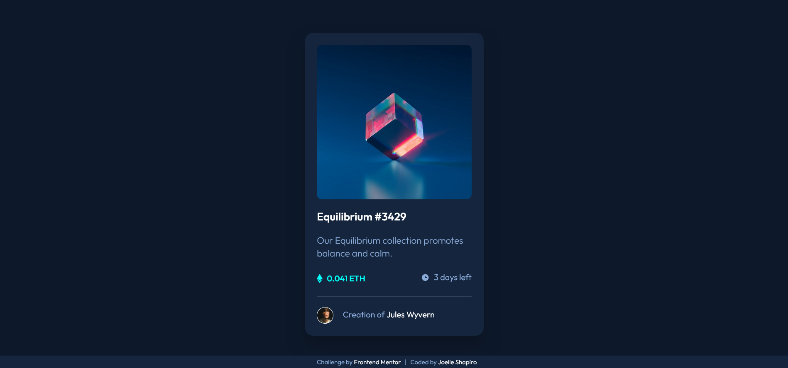

# Frontend Mentor - NFT preview card component solution

This is a solution to the [NFT preview card component challenge on Frontend Mentor](https://www.frontendmentor.io/challenges/nft-preview-card-component-SbdUL_w0U). Frontend Mentor challenges help you improve your coding skills by building realistic projects. 

## Table of contents

  - [Overview](#overview)
  - [The challenge](#the-challenge)
  - [Screenshot](#screenshot)
  - [Links](#links)
  - [My process](#my-process)
  - [Built with](#built-with)
  - [Useful resources](#useful-resources)
  - [Author](#author)

## Overview

### The challenge

Users should be able to:

- View the optimal layout depending on their device's screen size
- See hover states for interactive elements

### Screenshot

### Links

- Solution URL: [Add solution URL here](https://your-solution-url.com)
- Live Site URL: [Add live site URL here](https://your-live-site-url.com)

## My process

### Built with

- Semantic HTML5 markup
- CSS custom properties
- Flexbox

### Useful resources

- [The Surprising Truth About Pixels and Accessibility](https://www.joshwcomeau.com/css/surprising-truth-about-pixels-and-accessibility/) - This wasn't necessarily referred to during working on this specific project but is something I think back to overall as I found it very informative in how/when to choose between pixels, ems, and rems.

## Author

- GitHub - [Capricornered](https://github.com/Capricornered)
- Frontend Mentor - [@capricornered](https://www.frontendmentor.io/profile/capricornered)